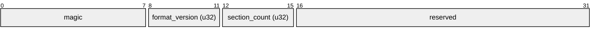
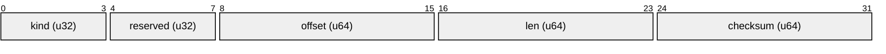
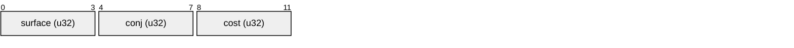
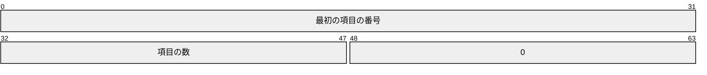

# バイナリの辞書

解析せずにそのまま引くための辞書ファイルの形式（版 1）。利用者がテキストの辞書から変換して作るか、辞書を作る側が作る。

## 中身

辞書は「項目」の集まり。項目は 1 つの語で、表記・活用型・コストを持つ。ファイルは、項目と、項目を探すための索引を、次のセクションに分けて持つ。

| セクション | 持つもの | 例 |
| --- | --- | --- |
| `ENTRIES` | 項目。固定長で並ぶ | 書（活用型 五段-カ行）、記者 |
| `INDEX` | 読みから項目を探す索引 | か → 書・蚊…、きしゃ → 記者・汽車… |
| `OKURI` | 送り仮名を指定したときに項目を探す索引 | かk → 書… |
| `STRINGS` | 表記・活用型の名前などの文字列 | 書、記者、五段-カ行 |

項目の中の文字列は、`STRINGS` の中の位置で指す。同じ文字列は 1 度だけ持つ。

## ファイル

- 拡張子は `.kdic`。ファイルの先頭が `magic` ならバイナリの辞書、そうでなければテキストの辞書として読む。

## ファイルの並び

- 先頭の Header に続いて、セクションごとに 1 つ SectionEntry（種類・位置・長さ）が並び、そのあとに各セクションが続く。
- 整数はすべてリトルエンディアン。

以下の構造の図は、1 目盛りが 1 バイト、上の数字がバイトの位置。

### Header

`magic` は `KANAEMID`、`format_version` は `1`、`reserved` はすべて `0`。

### SectionEntry

`offset` はファイルの先頭からの位置、`checksum` はセクションの中身の XXH3-64、`reserved` は `0`。

| kind | セクション | |
| --- | --- | --- |
| 1 | `STRINGS` | 必須 |
| 2 | `INDEX` | 必須 |
| 3 | `ENTRIES` | 必須 |
| 4 | `OKURI` | |
| 5 | `SOURCE` | |

知らない `kind` のセクションは読み飛ばす。

## セクション

### ENTRIES

項目を 12 バイトずつ並べたもの。項目は先頭から 0, 1, 2 … と番号で指す。

- `surface`（表記）・`conj`（[活用型](conjugation.md) の名前）は、`STRINGS` の中の位置。`0` は「なし」（空の文字列）。`OKURI` の項目の `surface` は空でもよい（送り仮名だけの語）。
- 活用する語の `surface` は語幹の表記（「書く」なら 書）。
- [置き場所](placeholder.md) のある項目の読み（`INDEX` のキー）と表記では、置き場所の `{`・`}` を U+FDD0・U+FDD1 で持つ。文字としての `{`・`}` はそのまま持つ。
- `cost` は小さいほど候補の先に並ぶ。
- 同じ索引のキーに属する項目は、連続して並ぶ。

### STRINGS

文字列を、長さ（u16、バイト数）と UTF-8 のバイト列の組で並べたもの。文字列は、その組の先頭の位置で指す。位置 `0` には空文字列を置き、「なし」に使う。

### INDEX

読みから項目を探す索引。Rust の [`fst`](https://crates.io/crates/fst) crate（0.4 系）の `Map` のバイト列そのもので、キーは語幹の読み（UTF-8）、値はその読みの項目の範囲。

キーごとの範囲は 1 つ以上の項目を持ち、ほかのキーの範囲と重ならない。

値は次のように 2 つの数を詰めた u64（この図だけ 1 目盛りが 1 ビット）。

### OKURI

送り仮名を指定したときに項目を探す索引。形は `INDEX` と同じで、キーが違う。

- キーは「送り仮名の前の読み」＋「送り仮名の最初のかなの行を表す英字」。例：書く → `かk`、皆さん → `みなs`、明らか → `あきr`。
- 項目の `surface` は送り仮名の前の表記（書・皆・明）。
- 活用する語にも、しない語にも持てる。テキストの辞書から作るときは、送り仮名付きの語だけが入る。

| かな | 英字 |
| --- | --- |
| あ・い・う・え・お | a・i・u・e・o |
| か行・が行 | k・g |
| さ行・ざ行（じ を除く）・じ | s・z・j |
| た行（ち・つ を含む）・っ | t |
| だ行 | d |
| な行・ん | n |
| は行（ふ を除く）・ふ | h・f |
| ば行・ぱ行・ゔ | b・p・v |
| ま行・や行・ら行 | m・y・r |
| わ・ゐ・ゑ・を | w |
| ぁ・ぃ・ぅ・ぇ・ぉ・ゃ・ゅ・ょ・ゎ・ゕ・ゖ | x |

小さいかなは、大きいかなの行に入れず `x` にまとめる。大きいかなと同じ行にすると、`;tachi;ya` でも 達ゃ を 達や として引いてしまう。っ は、子音を重ねて打つので た行に入れる。

表にないかなで始まる送り仮名では、`OKURI` を引かない。

### SOURCE

変換元のテキストの辞書のファイルの SHA-256（32 バイト）。テキストの辞書から変換したときだけ持つ。今のテキストの辞書と比べれば、変換し直す必要があるかが分かる。

## 書く側の決まり

読む側は確かめないが、書く側は守る。

- 各セクションは 64 バイト境界から始める。間は 0 で埋める。
- 読みと表記は NFC で書く。NFC でない読みは引けない。
- `INDEX` と `OKURI` は、`fst` の形式の版 3 で書く。
- 読む側は、開いたファイルを開いている間ずっと引き続ける。使われているファイルをその場で書き換えず、別の名前で書き終えてから元の名前に置き換える。

## 読めないファイル

次のどれかに当たるファイルは、辞書として使わない。

- `magic` か `format_version` が違う。`reserved` が `0` でない。
- 必須のセクションがない、同じ `kind` が 2 つある、またはセクションがファイルの外にはみ出す。
- セクションの中身や参照が、この形式どおりでない。
- チェックサムが合わない（確かめたとき）。

## テキストの辞書からの変換

[テキストの辞書](text-dictionary.md) から変換したものは、変換の前と同じ候補を同じ並びで出す。`!` の行と、この形式で表せない行（65,535 バイトを超える文字列、同じキーで 65,535 個より後の項目）は移さない。
