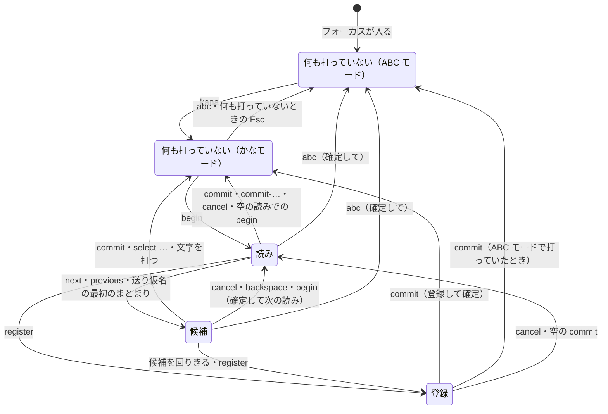

# 入力方式

この文書では、操作をキーではなく機能（`next` など）で書く。どのキーがどの機能を持つか、各機能が何をするかは [キーバインド](keybindings.md) で決まる。例のキーは、`begin` を `;` に割り当てたときのもの。

## モード

| モード | すること |
| --- | --- |
| ABC モード | 英字をそのまま打つ |
| かなモード | ローマ字でかなを打ち、その場で確定する（watashiha → わたしは） |

かなモードで打つ文字は [ローマ字の表](romaji-table.md) で決まる。

## 場面

キーの働きは、場面ごとに決まる。

| 場面 | いること |
| --- | --- |
| 何も打っていない | 未確定文字列がない。かなモードと ABC モードで別の場面 |
| 読み | 変換する読みを打っている |
| 候補 | 候補を選んでいる |
| 登録 | その場で登録する語を打っている |

図は、登録の場面の中で入る読み・候補の場面（入れ子）と、フォーカスが外れたときの確定を省いている。未確定文字列の印は [表示](display.md) で決まる。

## モードの切り替え

| 操作 | 結果 |
| --- | --- |
| `kana` | かなモードへ。モードの表示を出す |
| `abc` | 打っている内容を確定して ABC モードへ（読みはかなのまま、候補は選んでいるもの）。モードの表示を出す |
| 未確定文字列がないときの Esc（Esc に機能を割り当てていないとき） | アプリに渡して ABC モードへ |

## 共通

- 内部でエラーが起きたら、未確定文字列を消して初めの場面に戻り、キーはアプリに渡す。
- 入力欄にフォーカスが入ったら ABC モードから始める。パスワード欄では、かなモードに入らない。
- フォーカスが外れたとき、入力欄をクリックしたとき、アプリ・OS から求められたときは、見えているものを確定する。読みの場面なら読み、候補の場面なら選んでいる候補、登録の場面なら最初の読みで、印は含めない。

## 読み

かなモードで何も打っていないときの `begin` で、読みの場面に入る（`;kanji` → 読み「かんじ」）。読みは数字や記号からも始められる（`;1ko` → 読み「１こ」）。

- 打った文字はカーソルの位置に入る。変換・確定は、カーソルの位置によらず読み全体で行う。
- 確定するときのローマ字の打ちかけは、[ローマ字の表](romaji-table.md#規則のほかの打ち方) の決まりで扱う。
- 読みが空のときの `begin` は、読みの場面を抜け、`begin` に割り当てたキーの文字を打つ（`;;` → `；`）。文字を打たないキーなら、読みの場面を抜けるだけ。
- `backspace` で読みを空にしても、読みの場面に残る（読みの印だけが出る）。空の読みでの `backspace` で、かなモードの何も打っていない場面に戻る。
- 読みにその形がないとき（かなのない読み `pdf` のひらがななど）は、`commit-…` は確定しない。

## 送り仮名

読みの途中の `begin` で、そこが送り仮名の始まりになる。送り仮名の最初のまとまりを打った時点で変換する（`;ka;ku` → 候補「書く」、`;ta;be` → 「食べ」）。

- まとまりは 1 つのローマ字の規則（kya → きゃ、tta → っ）。余ったローマ字は候補の後ろに残り、候補をどの方法で確定しても次の語に続く（`;mo;tt` → 「持っ」と打ちかけ「t」）。
- 打ちかけを仕上げるキーは、候補の場面のまま候補の後ろに入る（`;ki;tta` → 「切った」「来った」から選ぶ）。仕上がったあとに打った文字と、打ちかけを続けない文字（`;mo;tt` のあとの `k`）は、候補を確定する。候補の場面の `backspace` は、ここで打ったキーから消す。`cancel` や登録では、ここで打ったキーは消える。
- 送り仮名の始まりは、カーソルが末尾にあるときだけ付けられる。それ以外の `begin` は何もしない。ローマ字の打ちかけがあれば、先にかなにして読みに入れてから付ける（`;kan;ji` → 読み「かん」と送り仮名「じ」）。付けたあとは、カーソルは動かない。
- 送り仮名を付けたあとの `begin` は何もしない。
- `backspace` は、打ちかけ、送り仮名、送り仮名の始まりの順に消す。候補の場面で `cancel` すると、送り仮名を残したまま読みの場面に戻る。
- 送り仮名を付けなければ（`;kaku` のあとに `next`）、送り仮名の指定なしで変換する。

## 候補

- 候補は、変換の結果の後ろに、読みのカタカナ・半角カタカナ・全角英数・半角英数を足したもの。前に同じものがあれば足さない。ひらがなは、`hiragana` で選んだときに最後に足す。
- 英数は、読みを打ったキーから作る（`kanji` → `ｋａｎｊｉ`・`kanji`）。
- `begin` は、選んでいる候補を確定してから、次の読みを始める。
- 一覧の候補をマウスで選ぶと、その候補を確定する。
- `forget` は、読みから作った候補（カタカナや英数）には効かない。

## 登録

候補を回りきるか `register` で、その読みで登録の場面に入る。登録する文字列はふだんどおりに打ち（`begin` で読みを始めて変換もでき、`abc` で ABC モードにすれば英字も打てる）、`commit` で [ユーザーカスタム辞書](text-dictionary.md#ユーザーカスタム辞書) に登録して確定する。

- 登録する文字列が空のときの `commit` は、登録せずに読みの場面へ戻る。
- `cancel` や空の `commit` で読みの場面に戻るときは、登録の中で ABC モードにしていても、かなモードに戻る。
- 登録の中で ABC モードにして `commit` したときは、ABC モードのまま確定する。
- 登録の場面の中で読み・候補の場面に入っている間は、その場面の機能が先に効く。
- 登録の場面の中で、さらに登録の場面に入れる。内側で登録した語は、外側の登録する文字列に入る。入れ子は 3 段までで、3 段目では最後の候補の次が最初の候補になる。
- 送り仮名付きの読み（`;nu;nu`）では、送り仮名付きの語として登録する。登録する文字列が送り仮名で終わっていなければ、送り仮名を足して登録し、確定する（x → xぬ）。
