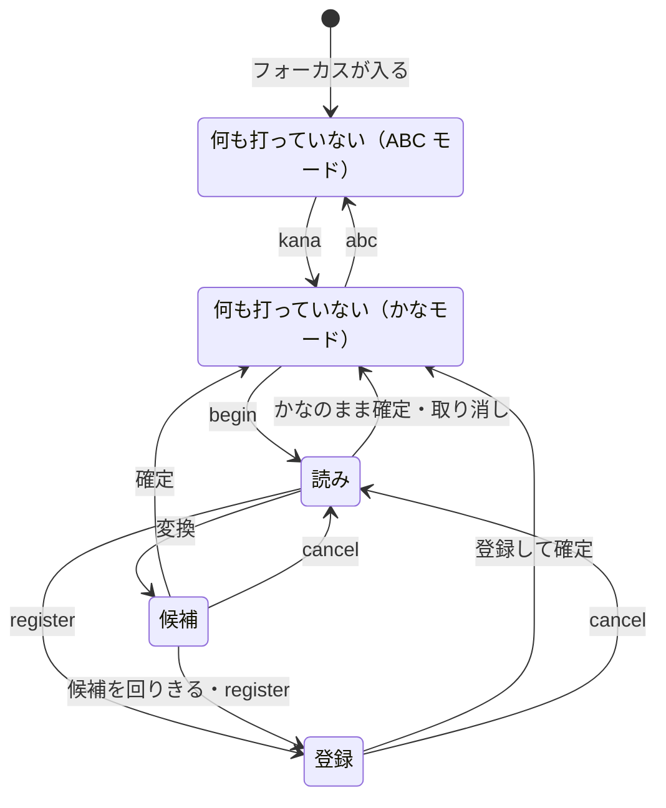

# 入力方式

この文書では、操作をキーではなく機能（`next` など）で書く。どのキーがどの機能を持つか、各機能が何をするかは [キーバインド](keybindings.md) で決まる。例のキーは、`begin` を `;` に割り当てたときのもの。

## モード

ABC モードでは、英字をそのまま打つ。かなモードでは、ローマ字でかなを打ち、その場で確定する（watashiha → わたしは）。かなモードで打つ文字は [ローマ字の表](romaji-table.md) で決まる。

## 場面

キーの働きは、場面ごとに決まる。

| 場面 | いること |
| --- | --- |
| 何も打っていない | 未確定文字列がない。かなモードと ABC モードで別の場面 |
| 読み | 変換する読みを打っている |
| 候補 | 候補を選んでいる |
| 登録 | その場で登録する語を打っている |

図は主な流れだけを描いている。未確定文字列の印は [表示](display.md) で決まる。

## モードの切り替え

`kana` でかなモードに、`abc` で ABC モードに切り替わる。`abc` は、読み・候補の場面では打っている内容を確定してから切り替え、登録の場面では確定せずに切り替えて、登録する文字列を英字で打てるようにする。未確定文字列がないときの Esc は、Esc に機能を割り当てていなければ、アプリに渡して ABC モードに切り替える。

## 共通

- 内部でエラーが起きたら、未確定文字列を消して初めの場面に戻り、キーはアプリに渡す。
- 入力欄にフォーカスが入ったら ABC モードから始める。パスワード欄では、かなモードに入らない。
- アプリが入力欄に一時的な入力先を重ねたとき、重ねたものを外したときは、ほかの入力欄に移ったとはみなさない。見えているものを前の入力先で確定し、モードはそのまま新しい入力先で続ける。
- フォーカスが外れたとき、入力欄をクリックしたとき、アプリ・OS から求められたときは、見えているものを、印を除いて確定する。読みの場面なら読み、候補の場面なら選んでいる候補、登録の場面なら最初の読みを確定する。
  - 次の入力欄に移ってからフォーカスが外れたことを伝える入力の仕組みでは、フォーカスが外れたときは確定せずに捨てる。

## 読み

かなモードで何も打っていないときの `begin` で、読みの場面に入る（`;kanji` → 読み「かんじ」）。読みは数字や記号からも始められる（`;1ko` → 読み「１こ」）。

- 読みの中でカーソルを動かして、打ち直せる。変換・確定は、カーソルの位置によらず読み全体で行う。
- 読みが空のときの `begin` は、読みの場面を抜け、`begin` に割り当てたキーの文字を打つ（`;;` → `；`）。

## 補完

読みと候補の場面の `complete` で、いま打った読みを、それで始まるより長い読みに置き換える（[読みの補完は、利用者が頼んだときだけ行う](../adr/20261009-complete-a-reading-only-when-asked.md)）。補完する読みとその並びは [変換](conversion.md#補完) で決まる。例のキーは、`complete` を Tab に割り当てたときのもの。

- 続けて `complete` を押すと、次の読みに置き換え、最後の次は打った読みに戻る（`;kaku` → Tab → `›かくにん` → Tab → `›かくご` → … → `›かく`）。`complete-previous` は逆向きに回る。
- 補完しているあいだは、補完の読みの一覧を候補と同じく出し、そこから読みを選べる。一覧が出ているあいだのキーは、[補完の一覧](keybindings.md#補完の一覧) の場面の割り当てで決まる。
- 補完した読みは、打った読みと同じに扱う。そのまま変換も確定も編集もできる。
- ほかのキーを押すと、補完は終わる。ただし、一覧から番号で読みを選んだときは補完が続く。補完した読みを変換したときも、候補の場面でも補完が続く（`;kaku` → Tab → `›かくにん` → Space → `»確認` → Tab → `›かくご`）。
- `cancel` は一つ前に戻る（`;kaku` → Tab → `›かくにん` → Space → `»確認` → Esc → `›かくにん`（一覧あり）→ Esc → `›かく` → Esc → 取り消し）。
- 送り仮名の始まりを付けた読みは補完しない。

## 送り仮名

読みの途中の `begin` で、そこが送り仮名の始まりになる。送り仮名の最初のまとまりを打った時点で変換する（`;ka;ku` → 候補「書く」、`;ta;be` → 「食べ」）。

- まとまりは 1 つのローマ字の規則（kya → きゃ、tta → っ）。余ったローマ字は候補の後ろに残り、候補をどの方法で確定しても次の語に続く（`;mo;tt` → 「持っ」と打ちかけ「t」）。
- 打ちかけを仕上げると、候補の場面のまま、仕上がったかなを送り仮名に足して変換し直す（`;ka;tta` → 送り仮名「った」で変換し、「勝った」「買った」から選ぶ）。
- 送り仮名の始まりは、カーソルが末尾にあるときだけ付けられる。
- 候補の場面で `cancel` か `backspace` を押すと、送り仮名を残したまま読みの場面に戻る。
- 送り仮名を付けなければ（`;kaku` のあとに `next`）、送り仮名の指定なしで変換する。

## 確定の取り消し

かなモードで何も打っていないときの `undo-commit` で、直前に確定した候補を、候補の場面に戻す（[確定の取り消しは、Kanaemi が出した文字列だけにする](../adr/20261006-undo-only-the-text-kanaemi-committed.md)）。読み・送り仮名・候補の並び・選んでいた候補は、確定したときのまま（`;kakuchou` を「格調」で確定 → `undo-commit` → `»格調` → `next` → `»拡張`）。

- 戻せるのは、その候補を確定してから、Kanaemi が出した文字列だけが後ろに続いている間。キーをアプリに渡したとき、フォーカスが移ったとき、マウスのボタンを押したときに戻せなくなる。戻せるのは、最後に確定した候補だけ。読みをかなのまま確定したものと、登録して確定したものは戻せない。
- 戻すときは、確定した候補と、その後ろに出した文字列を入力欄から消す。消せないとき（OS の許可がないときなど）は戻さず、押したキーをそのままアプリに渡す。
- 戻したあとは、ふだんの候補・読みの場面と同じに操作できる。ただし `cancel` は、元の文字列を確定し直して終える。
- 取り消した確定は、[確定履歴](conversion.md#確定履歴) と [よく選ぶ候補](conversion.md#よく選ぶ候補) から外す。`cancel` で元に戻したときは、もう一度確定したものとする。
- 戻せる確定がないときの `undo-commit` は、キーをアプリに渡す。

## 打ったかなを読みに戻す

かなモードで何も打っていないときの `reread-kana` で、打ったばかりのかなを入力欄から消して、読みの場面に戻す（[打ったばかりのかなを、読みに戻せるようにする](../adr/20261009-take-kana-just-typed-back-to-a-reading.md)）。`begin` を打ち忘れたときに使う（`kanji` → かんじ → `reread-kana` → `›かんじ` → `next` → `»漢字`）。

- 戻すのは、かなモードで何も打っていないときに打ったかなのうち、最後のひと続き。Kanaemi が入力欄にかな以外の文字や候補を出すと、ひと続きはそこで切れる。
- 戻した読みに手を付ける前に `reread-kana` をもう一度押すと、読みの最初のかなを確定して、残りを読みにする（`›はかんじ` → `reread-kana` → 「は」を確定して `›かんじ`）。
- 戻せる条件と消し方は、[確定の取り消し](#確定の取り消し) と同じ。
- 戻した読みは、ふだんの読みと同じに操作できる。ただし読みの場面の `cancel` は、元のかなを確定し直して終える。
- 読みを始めてかなのまま確定したものは戻せない。変換した確定は、確定の取り消しで戻す。
- 戻すかながないときの `reread-kana` は、キーをアプリに渡す。

## 候補

- 候補は、[変換](conversion.md) の結果に、読みのカタカナ・半角カタカナ・全角英数・半角英数を足したもの。英数は、読みを打ったキーから作る（`kanji` → `ｋａｎｊｉ`・`kanji`）。
- `begin` は、選んでいる候補を確定してから、次の読みを始める。
- 一覧の候補をマウスで選ぶと、その候補を確定する。
- `forget` で、選んでいる辞書の候補を以後出さないようにできる。1 度目の `forget` では確かめるだけで、もう一度押したときに除外する。

## 登録

候補を回りきるか `register` で、その読みで登録の場面に入る。登録する文字列はふだんどおりに打ち（`begin` で読みを始めて変換もでき、`abc` で ABC モードにすれば英字も打てる）、`commit` で [ユーザーカスタム辞書](text-dictionary.md#ユーザーカスタム辞書) に登録して確定する。

- 語は読みのかなで登録するので、かなのない読み（`pdf`）では登録の場面に入らない。
- 登録する文字列が空のときの `commit` と、`cancel` は、登録せずに読みの場面へ戻る。
- 登録の場面の中で、さらに登録の場面に入れる。内側で登録した語は、外側の登録する文字列に入る。
- 送り仮名付きの読み（`;nu;nu`）では、送り仮名付きの語として登録する。
