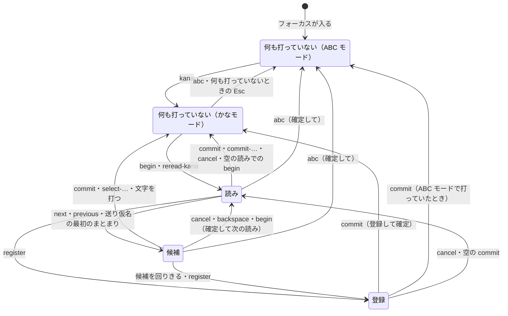

# 入力方式

この文書では、操作をキーではなく機能（`next` など）で書く。どのキーがどの機能を持つか、各機能が何をするかは [キーバインド](keybindings.md) で決まる。例のキーは、`begin` を `;` に割り当てたときのもの。

## モード

| モード | すること |
| --- | --- |
| ABC モード | 英字をそのまま打つ |
| かなモード | ローマ字でかなを打ち、その場で確定する（watashiha → わたしは） |

かなモードで打つ文字は [ローマ字の表](romaji-table.md) で決まる。

## 場面

キーの働きは、場面ごとに決まる。

| 場面 | いること |
| --- | --- |
| 何も打っていない | 未確定文字列がない。かなモードと ABC モードで別の場面 |
| 読み | 変換する読みを打っている |
| 候補 | 候補を選んでいる |
| 登録 | その場で登録する語を打っている |

図は、登録の場面の中で入る読み・候補の場面（入れ子）と、フォーカスが外れたときの確定を省いている。未確定文字列の印は [表示](display.md) で決まる。

## モードの切り替え

| 操作 | 結果 |
| --- | --- |
| `kana` | かなモードへ。モードの表示を出す |
| `abc` | 打っている内容を確定して ABC モードへ（読みはかなのまま、候補は選んでいるもの）。モードの表示を出す |
| 未確定文字列がないときの Esc（Esc に機能を割り当てていないとき） | アプリに渡して ABC モードへ |

## 共通

- 内部でエラーが起きたら、未確定文字列を消して初めの場面に戻り、キーはアプリに渡す。
- 入力欄にフォーカスが入ったら ABC モードから始める。パスワード欄では、かなモードに入らない。
- アプリが入力欄に一時的な入力先を重ねたとき、重ねたものを外したときは、ほかの入力欄に移ったとはみなさない。見えているものを前の入力先で確定し、モードはそのまま新しい入力先で続ける。
- フォーカスが外れたとき、入力欄をクリックしたとき、アプリ・OS から求められたときは、見えているものを確定する。読みの場面なら読み、候補の場面なら選んでいる候補、登録の場面なら最初の読みで、印は含めない。
  - Linux（IBus）では、フォーカスが外れたときは確定せずに捨てる。IBus はエンジンを次の入力欄に付け替えてから、フォーカスが外れたことを伝えるため、ここで確定すると次の入力欄に入ってしまう。

## 読み

かなモードで何も打っていないときの `begin` で、読みの場面に入る（`;kanji` → 読み「かんじ」）。読みは数字や記号からも始められる（`;1ko` → 読み「１こ」）。

- 打った文字はカーソルの位置に入る。変換・確定は、カーソルの位置によらず読み全体で行う。
- 確定するときのローマ字の打ちかけは、[ローマ字の表](romaji-table.md#規則のほかの打ち方) の決まりで扱う。
- 読みが空のときの `begin` は、読みの場面を抜け、`begin` に割り当てたキーの文字を打つ（`;;` → `；`）。文字を打たないキーなら、読みの場面を抜けるだけ。
- `backspace` で読みを空にしても、読みの場面に残る（読みの印だけが出る）。空の読みでの `backspace` で、かなモードの何も打っていない場面に戻る。
- 読みにその形がないとき（かなのない読み `pdf` のひらがななど）は、`commit-…` は確定しない。

## 補完

読みと候補の場面の `complete` で、いま打った読みを、それで始まるより長い読みに置き換える（[読みの補完は、利用者が頼んだときだけ行う](../adr/20261009-complete-a-reading-only-when-asked.md)）。補完する読みとその並びは [変換](conversion.md#補完) で決まる。例のキーは、`complete` を Tab、`complete-previous` を Shift+Tab に割り当てたとき（既定）のもの。

- 続けて `complete` を押すと、次の読みに置き換える。最後の次は、打った読みに戻る（`;kaku` → Tab → `›かくにん` → Tab → `›かくご` → … → `›かく`）。
- `complete-previous` は逆向きに回る。打った読みの前は最後の読み。補完する前に押すと、最後の読みに置き換える。
- 補完する読みがなければ、何もしない。
- 補完した読みは、打った読みと同じに扱う。変換・確定・編集・送り仮名の始まりは、ふだんの読みの場面と同じ。読みを打ったキーの英数（`full-alphanumeric`・`alphanumeric`）は、打った部分は打ったキー、補完で足した部分は [ローマ字の表](romaji-table.md) でつづったもの。
- 補完しているあいだは、補完の読みの一覧を、候補と同じく出し、置き換えた読みを選んでいるものとして示す。打った読みに戻ったときは出さない。押す前には出さない。一覧が出ているあいだのキーは、[補完の一覧](keybindings.md#補完の一覧) の場面の割り当てで決まる。
- 一覧が出ているあいだは、`select-1`〜`select-9` と、一覧の読みを選ぶ操作で、その読みに置き換える。そこから続けて `complete` を押すと、その次の読みに置き換える。
- `complete`・`complete-previous` と、一覧での `select-1`〜`select-9` のほかのキーを押すと、補完は終わる。次に押した `complete` は、そのときの読みから補完し直す。ただし、補完した読みを変換したときは、候補の場面でも補完が続く。
- 候補の場面で `complete` を押すと、読みの場面に戻って補完する。補完した読みを変換していたなら、その次の読みに置き換える（`;kaku` → Tab → `›かくにん` → Space → `»確認` → Tab → `›かくご`）。打った読みをそのまま変換していたなら、その読みから補完する。`complete-previous` は逆向き。補完する読みがなければ、候補の場面のまま何もしない。
- `cancel` は一つ前に戻る。補完した読みを変換した候補の場面では、変換した読みを選んだまま補完の一覧に戻り、補完の一覧では打った読みに戻る（`;kaku` → Tab → `›かくにん` → Space → `»確認` → Esc → `›かくにん`（一覧あり）→ Esc → `›かく` → Esc → 取り消し）。
- 補完するのは、ローマ字の打ちかけをかなにしたあとの読み全体で、カーソルの位置によらない。補完した読みでは、カーソルは末尾にある。打った読みに戻ったときは、カーソルも戻る。
- 読みが空のときと、送り仮名の始まりを付けたあとは、何もしない。

## 送り仮名

読みの途中の `begin` で、そこが送り仮名の始まりになる。送り仮名の最初のまとまりを打った時点で変換する（`;ka;ku` → 候補「書く」、`;ta;be` → 「食べ」）。

- まとまりは 1 つのローマ字の規則（kya → きゃ、tta → っ）。余ったローマ字は候補の後ろに残り、候補をどの方法で確定しても次の語に続く（`;mo;tt` → 「持っ」と打ちかけ「t」）。
- 打ちかけを仕上げるキーは、候補の場面のまま、仕上がったかなを送り仮名に足して変換し直す（`;ka;tta` → 送り仮名「った」で変換し、「勝った」「買った」から選ぶ）。選んでいた候補は、仕上がったかなを足した表記が候補にあれば、選んだままにする。読みから作った候補（カタカナや英数）を選んでいたなら、伸びた読みから同じ形を作って選ぶ。仕上がったあとに打った文字と、打ちかけを続けない文字（`;mo;tt` のあとの `k`）は、候補を確定する。
- 候補の場面で打ってまだかなになっていないキーは、`cancel`・`backspace` や登録で消える。
- 送り仮名の始まりは、カーソルが末尾にあるときだけ付けられる。それ以外の `begin` は何もしない。ローマ字の打ちかけがあれば、先にかなにして読みに入れてから付ける（`;kan;ji` → 読み「かん」と送り仮名「じ」）。付けたあとは、カーソルは動かない。
- 送り仮名を付けたあとの `begin` は何もしない。
- `backspace` は、打ちかけ、送り仮名、送り仮名の始まりの順に消す。打ちかけの続きで足したかなは、打ちかけに戻して消す。候補の場面で `cancel` か `backspace` を押すと、送り仮名を残したまま読みの場面に戻る。
- 送り仮名を付けなければ（`;kaku` のあとに `next`）、送り仮名の指定なしで変換する。

## 確定の取り消し

かなモードで何も打っていないときの `undo-commit` で、直前に確定した候補を、候補の場面に戻す（[確定の取り消しは、Kanaemi が出した文字列だけにする](../adr/20261006-undo-only-the-text-kanaemi-committed.md)）。読み・送り仮名・候補の並び・選んでいた候補は、確定したときのまま（`;kakuchou` を「格調」で確定 → `undo-commit` → `»格調` → `next` → `»拡張`）。

- 戻せるのは、その候補を確定してから、Kanaemi が出した文字列だけが後ろに続いている間。キーをアプリに渡したとき、フォーカスが移ったとき、マウスのボタンを押したとき（キャレットが動いたかもしれないので、どこで押しても）に戻せなくなる。次の候補を確定したら、戻せるのはその候補。読みをかなのまま確定したものと、登録して確定したものは戻せない。
- 戻すときは、確定した候補と、その後ろに出した文字列を入力欄から消してから、候補の場面にする。消すために、書記素ごとに 1 つずつ Backspace をアプリに送り、送ったすべてをアプリが受け取ってから候補の場面にする。送れないとき（OS の許可がないときなど）は戻さず、押したキーをそのままアプリに渡す。受け取られるまでに押したキーは、そのあとで押した順に扱う（アプリには渡らない）。
- 受け取られるまでに ABC モードになったときは、候補の場面にせず、消した文字列をそのまま確定し直す。
- 後ろに出した文字列（「格調する」の「する」）は、候補の後ろに出しておき、確定すると、確定したものの後ろに戻す。
- 戻したあとは、ふだんの候補・読みの場面と同じに操作できる。ただし `cancel` は、候補の場面でも読みの場面でも、元の文字列を確定して終える。
- 取り消した確定は、[確定履歴](conversion.md#確定履歴) と [よく選ぶ候補](conversion.md#よく選ぶ候補) から外す。`cancel` で元に戻したときは、もう一度確定したものとする。
- 戻せる確定がないときの `undo-commit` は、キーをアプリに渡す。

## 打ったかなを読みに戻す

かなモードで何も打っていないときの `reread-kana` で、打ったばかりのかなを入力欄から消して、読みの場面に戻す（[打ったばかりのかなを、読みに戻せるようにする](../adr/20261009-take-kana-just-typed-back-to-a-reading.md)）。`begin` を打ち忘れたときに使う（`kanji` → かんじ → `reread-kana` → `›かんじ` → `next` → `»漢字`）。

- 戻すのは、かなモードで何も打っていないときにローマ字の表で打ったかなのうち、最後のひと続き。ひと続きは、ひらがなと「ー」だけからなる。
- Kanaemi が入力欄にほかの文字列を出すと、ひと続きはそこで切れる。かな以外の文字（「、」「。」・数字・記号・英字）、候補の確定、読みをかなのまま確定したもの、登録して確定したものがこれに当たる（`;watashi` を「私」で確定して `hakanji` → 戻すのは「はかんじ」）。
- ローマ字の打ちかけがあれば、読みの後ろに打ちかけとして続ける（`nihon` → 「にほ」と打ちかけ `n` → `›にほn`）。読みは打ったキーも覚えているので、英数の候補も作れる。
- 戻した読みが戻したときのままの間（文字を打つ、消す、カーソルを動かす、変換する前）は、`reread-kana` をもう一度押すと、読みの最初のかな（一緒に打ったまとまり。`kya` なら「きゃ」）を確定して、残りを読みにする（`›はかんじ` → `reread-kana` → 「は」を確定して `›かんじ`）。読みのかなが 1 まとまりしかないとき、戻したときのままでないときは何もしない。
- 戻せる条件は [確定の取り消し](#確定の取り消し) と同じ。キーをアプリに渡したとき、フォーカスが移ったとき、マウスのボタンを押したときに戻せなくなる。
- 消し方と、消し終えるまでに押したキーの扱いも、確定の取り消しと同じ。書記素ごとに 1 つずつ Backspace をアプリに送り、送ったすべてをアプリが受け取ってから読みの場面にする。送れないときは戻さず、押したキーをそのままアプリに渡す。
- 受け取られるまでに ABC モードになったときは、読みの場面にせず、消したかなをそのまま確定し直す。打ちかけは、[ローマ字の表](romaji-table.md#規則のほかの打ち方) の決まりで扱う。
- 戻した読みは、ふだんの読みと同じに操作できる。ただし読みの場面の `cancel` は、元のかなを確定し直し、打ちかけも元に戻して終える。そのかなは、もう一度戻せる。候補の場面の `cancel` は、ふだんどおり読みの場面に戻る。
- 戻したかなは、確定履歴にもよく選ぶ候補にも入っていないので、学んだことから外すものはない。
- 候補を確定したあとに打ったかなを戻しても、その候補は確定の取り消しで戻せる。そのとき消して戻すのは、候補と、その後ろに残っている文字列。
- 読みを始めて、かなのまま確定したものは戻せない。変換した確定は、確定の取り消しで戻す。
- 戻すかながないときの `reread-kana` は、キーをアプリに渡す。

## 候補

- 候補は、[変換](conversion.md) の結果の後ろに、読みのカタカナ・半角カタカナ・全角英数・半角英数を足したもの。前に同じものがあれば足さない。ひらがなは、`hiragana` で選んだときに最後に足す。
- 英数は、読みを打ったキーから作る（`kanji` → `ｋａｎｊｉ`・`kanji`）。
- `begin` は、選んでいる候補を確定してから、次の読みを始める。
- 一覧の候補をマウスで選ぶと、その候補を確定する。
- `forget` は、読みから作った候補（カタカナや英数）には効かない。
- `forget` を 1 度押すと、選んでいる候補を出さないか確かめる。確かめている間は、候補の後ろに、もう一度同じキーを押すと候補から除外することを文で示す。もう一度 `forget` を押すと、その候補を以後出さない。キーを押したままにして OS が繰り返す入力は、もう一度押したことにならない（繰り返しを見分けられない環境を除く）。`cancel` を押すと、確かめるのをやめて候補の場面に残る。ほかのキーを押すと、何もしないキーでも、確かめるのをやめて、そのキーのふだんの働きをする。修飾キーだけを押しても、確かめるのはやめない。

## 登録

候補を回りきるか `register` で、その読みで登録の場面に入る。登録する文字列はふだんどおりに打ち（`begin` で読みを始めて変換もでき、`abc` で ABC モードにすれば英字も打てる）、`commit` で [ユーザーカスタム辞書](text-dictionary.md#ユーザーカスタム辞書) に登録して確定する。

- かなのない読み（`pdf`）では登録の場面に入らない。語は読みのかなで登録するので、かなのない読みには登録できない。候補の場面では、最後の候補の次が最初の候補になり、`register` は何もしない。読みの場面の `register` も何もしない。
- 登録する文字列が空のときの `commit` は、登録せずに読みの場面へ戻る。
- `cancel` や空の `commit` で読みの場面に戻るときは、登録の中で ABC モードにしていても、かなモードに戻る。
- 登録の中で ABC モードにして `commit` したときは、ABC モードのまま確定する。
- 登録の場面の中で読み・候補の場面に入っている間は、その場面の機能が先に効く。
- 登録の場面の中で、さらに登録の場面に入れる。内側で登録した語は、外側の登録する文字列に入る。入れ子は 3 段までで、3 段目では最後の候補の次が最初の候補になる。
- 送り仮名付きの読み（`;nu;nu`）では、送り仮名付きの語として登録する。登録する文字列が送り仮名で終わっていなければ、送り仮名を足して登録し、確定する（x → xぬ）。
